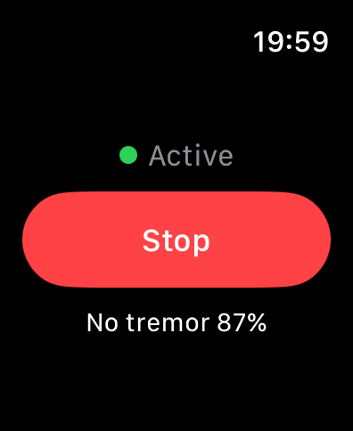
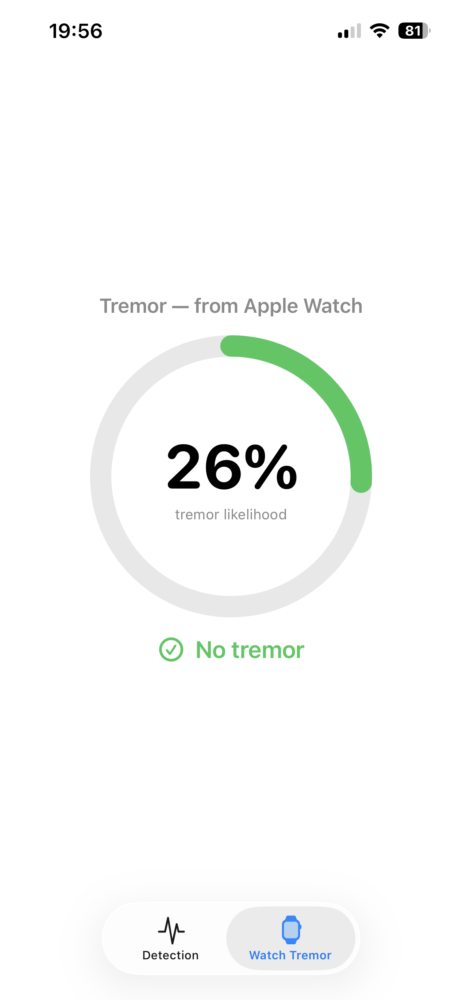
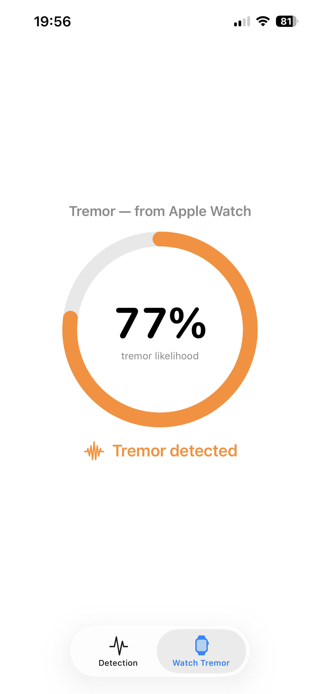
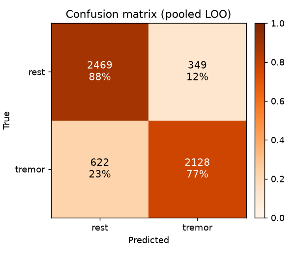
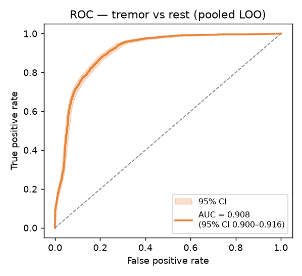
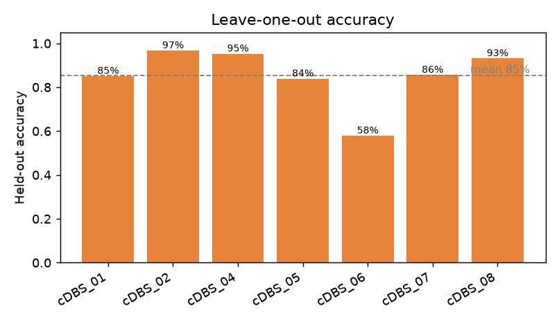
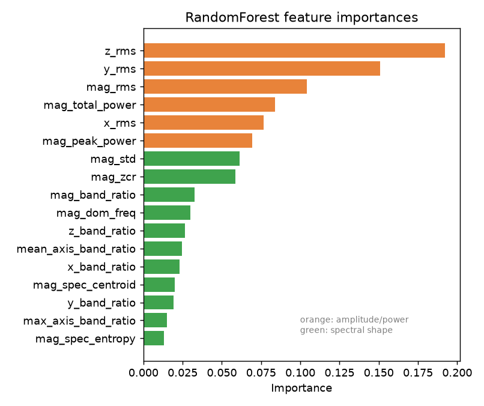

# Essential Watch

A paired **iOS + watchOS** app, built in SwiftUI, that uses the Apple Watch's
motion sensor to detect **essential tremor** in real time — entirely on-device.

The detector is a Core ML model trained on clinical wrist-accelerometer
recordings; see [`ml/README.md`](ml/README.md) for the data-prep and training
pipeline.

## Screenshots

| Watch (detecting) | iPhone — no tremor | iPhone — tremor |
|:---:|:---:|:---:|
|  |  |  |

The watch runs detection; the iPhone mirrors the live tremor likelihood over
WatchConnectivity.

## What it does today

- **On your Apple Watch:** tap **Start**, hold your hand up, and the app
  continuously checks whether your hand is shaking the way essential tremor does.
  It shows a live result — e.g. *"Tremor 87%"* or *"No tremor 92%"* — and
  highlights it when tremor is detected.
- **On your iPhone:** a companion screen shows the same result as a big
  percentage ring (green for steady, orange for tremor), kept in sync with the
  watch. The phone is just a display — all the detection happens on the watch.
- **Ignores everyday jitter:** tiny vibrations and a naturally unsteady hand are
  treated as *No tremor*, so it doesn't cry wolf.
- **Private and offline:** everything runs on the device. No account, no
  internet, no data leaves your wrist.

> ⚠️ Live detection needs a **real Apple Watch** — the watchOS Simulator has no
> motion sensor. You can still install and explore the interface in the
> Simulator; it just won't produce real readings.

## Dataset

The tremor classifier is trained on **"Bilateral tremor measurement in people
with essential tremor under DBS-OFF and DBS-ON conditions"**, an open dataset
from the MRC Brain Network Dynamics Unit, University of Oxford.

- **Source / download:** [data.mrc.ox.ac.uk — bilateral tremor measurement](https://data.mrc.ox.ac.uk/data-set/bilateral-tremor-measurement-people-essential-tremor-under-dbs-and-dbs-conditions)
- Lives locally in `Bilateral_tremor_data/` (git-ignored; see its
  `Dataset_Description.txt`).

**What it contains.** Bilateral wrist-accelerometer recordings from essential-
tremor patients performing a tremor-provoking posture-holding task (arms raised,
~30 s holds alternating with ~30 s rest), captured under two conditions:
continuous high-frequency DBS turned **OFF** and **ON**. Raw data are shared for
8 participants (`cDBS_01`–`cDBS_08`). Each `.mat` (MATLAB v7.3 / HDF5) holds a
6-channel accelerometer matrix (left + right wrist, x/y/z), the sampling rate
(2048 or 4096 Hz), and posture-block markers (`2` = block start, `3` = block end).

**How this project uses it.** Only the **DBS-OFF** recordings are used — that's
the untreated condition where tremor is strongest. Each posture block is labeled
*tremor* and the inter-block gaps *rest*; each wrist is treated as an independent
single-wrist sample (the watch has one accelerometer on one wrist). Full
preprocessing and training details are in [`ml/README.md`](ml/README.md).

**Reference.** He S, et al. *Tremor Asymmetry and the Development of Bilateral
Phase-Specific Deep Brain Stimulation for Postural Tremor.* Movement Disorders,
2025. [doi:10.1002/mds.30275](https://doi.org/10.1002/mds.30275) ·
[PubMed 40546090](https://pubmed.ncbi.nlm.nih.gov/40546090/)

Please cite the dataset and paper above if you use this work, and follow the
dataset's own license/terms from the Oxford data portal.

## Model performance

Evaluated with **leave-one-out (LOO)** cross-validation — each patient is held
out in turn, so these numbers reflect generalisation to a *new* patient. Pooled
LOO accuracy is **0.83** (mean per-patient **0.85**), ROC
**AUC = 0.908 (95% CI 0.900–0.916)**. The hardest case (cDBS_06) had weak,
low-amplitude tremor.

| | |
|:---:|:---:|
|  |  |
|  |  |

### Features the model looks at

The model doesn't see raw motion — every 2-second window is summarised into **17
numbers** describing the shape and strength of the movement. They fall into a few
families:

| Feature family | # | What it measures | Why it helps spot tremor |
|---|:--:|---|---|
| **Tremor-band power ratio** — `mag_band_ratio`, `x/y/z_band_ratio`, `max_axis_band_ratio`, `mean_axis_band_ratio` | 6 | Share of motion energy that sits in the 4–12 Hz tremor band (vs. all motion 1–24 Hz), per axis and overall | Tremor concentrates energy in 4–12 Hz; voluntary motion and noise spread it across other frequencies |
| **Amplitude (RMS)** — `mag_rms`, `x_rms`, `y_rms`, `z_rms` | 4 | How much the wrist is actually moving, in g | A trembling hand shakes harder than a steady one |
| **Dominant frequency** — `mag_dom_freq` | 1 | The single strongest frequency in the window (Hz) | Essential tremor peaks around 4–12 Hz |
| **Spectral power** — `mag_peak_power`, `mag_total_power` | 2 | Height of the strongest peak, and total energy | Captures overall shake strength and how "spiky" it is |
| **Spectral shape** — `mag_spec_entropy`, `mag_spec_centroid` | 2 | How peaked vs. flat the frequency content is, and its centre of mass | A clean rhythmic tremor has a sharp peak; noise looks flat |
| **Rhythm / variability** — `mag_std`, `mag_zcr` | 2 | Spread of the movement and how often it oscillates | Tremor is regular, repetitive shaking |

Before these are computed, gravity is removed and the signal is reduced to 50 Hz,
matching how the model was trained. Feature importances (above) show amplitude
and tremor-band features carry most of the signal. Regenerate the figures after
retraining with:

```sh
ml/.venv/bin/python ml/make_figures.py   # writes ml/figures/*.png
```

## Build & run

You'll need a **Mac with Xcode 26+**, and — for real detection — an **iPhone
paired with an Apple Watch** (watchOS 26 / iOS 26). A free Apple ID is enough to
install on your own devices.

1. **Get the code**

   ```sh
   git clone <your-repo-url> Essential_Watch
   cd Essential_Watch
   open Essential_Watch.xcodeproj
   ```

2. **Set your signing team.** In Xcode, select the project in the navigator →
   for each app target (*Essential_Watch* and *Essential_Watch Watch App*) open
   **Signing & Capabilities** and pick your **Team** (your Apple ID works). If
   needed, change the **Bundle Identifier** to something unique.

3. **Connect your devices.** Plug your iPhone into the Mac (or enable wireless
   debugging) and **Trust** it. Make sure the iPhone is already **paired with
   your Apple Watch** in the Watch app.

4. **Install.** Pick the **`Essential_Watch Watch App`** scheme, choose your
   Apple Watch as the run destination, and press **Run** (▶). Xcode installs the
   watch app; the iPhone companion installs alongside it. (First run may prompt
   you to trust the developer certificate on each device: *Settings → General →
   VPN & Device Management*.)

5. **Use it.** On the watch, open **Essential Watch** and tap **Start**. Hold
   your arm up and watch the live result. Open the iPhone app to see the same
   percentage, synced from the watch.

> Tip: you can also build/run in the **Simulator** to explore the UI, but it
> won't produce real readings (no motion sensor).

## How it works (technical)

### Detection pipeline (on the watch)

`MotionManager` streams the accelerometer at 50 Hz. For each sample,
`TremorPredictionService`:

1. **Removes gravity** with a streaming low-pass filter, leaving the dynamic
   acceleration (the same quantity CoreMotion calls `userAcceleration`).
2. **Buffers a 2-second sliding window** (100 samples) in a `SampleBuffer`.
3. **Extracts the 17 features** (`TremorFeatures`, a line-for-line port of the
   Python training code — verified numerically identical).
4. **Applies an amplitude gate:** if the tremor-band (4–12 Hz) acceleration RMS
   is below a small threshold (default **0.03 g**), the window is reported as
   *No tremor* regardless of the model. This suppresses false positives from
   sensor noise and low-amplitude physiological micro-tremor on a steady hand.
5. **Runs the Core ML model** (`TremorClassifier.mlmodel`) a few times per
   second and publishes the label + probability to the UI.

### Watch ↔ iPhone sync

After each prediction, the watch sends the result (probability + flag) to the
phone via **WatchConnectivity** (`TremorSyncSender` → `TremorSyncReceiver`). Only
the low-rate prediction (~2 Hz) is sent, not the raw 50 Hz accelerometer —
WatchConnectivity isn't suited to smooth high-rate streaming. The iPhone is a
read-only mirror with no model or motion capture of its own.

### Architecture

Service-oriented MVVM. On the watch, `TremorPredictionService` is injected behind
the `PredictionServicing` protocol, so the model can be retrained or swapped
without touching the views.

```
Essential_Watch/                   # iOS companion (read-only mirror)
  Views/TremorWatchView.swift      # percentage ring
  Services/Sync/                   # TremorSyncReceiver (WatchConnectivity)
Essential_Watch Watch App/         # watchOS app (primary)
  Views/ ViewModels/               # SwiftUI screens + UI state
  Services/Motion/                 # MotionManager, AccelerometerSample, MotionError
  Services/ML/                     # TremorPredictionService, TremorFeatures,
                                   #   SampleBuffer, TremorClassifier.mlmodel
  Services/Sync/                   # TremorSyncSender (WatchConnectivity)
Essential_Watch.xcodeproj/         # two app + four test targets
ml/                                # Python pipeline: prepare data + train Core ML model
```

Heavy artifacts — the raw dataset (`Bilateral_tremor_data/`), the Python
virtualenv (`ml/.venv/`), and generated files (`ml/features.csv`) — are
git-ignored; the deployed model lives in the watch app bundle.

### Command line & tests

```sh
# Build the watch app for the simulator
xcodebuild -project Essential_Watch.xcodeproj \
  -scheme "Essential_Watch Watch App" \
  -destination 'platform=watchOS Simulator,name=Apple Watch Series 11 (46mm)' \
  build

# Run the tests (Swift Testing for units; XCUITest for UI)
xcodebuild test -project Essential_Watch.xcodeproj \
  -scheme "Essential_Watch Watch App" \
  -destination 'platform=watchOS Simulator,name=Apple Watch Series 11 (46mm)'
```

Deployment targets are iOS 26 / watchOS 26 — latest-SDK SwiftUI APIs only.

## Roadmap

- ~~Replace the placeholder with a real Core ML classifier~~ ✅
- ~~Fixed-length windowing + on-device inference~~ ✅
- Tremor severity / scoring (regression) in addition to binary detection
- iOS companion: session history & model management

## License

See [LICENSE](LICENSE).
